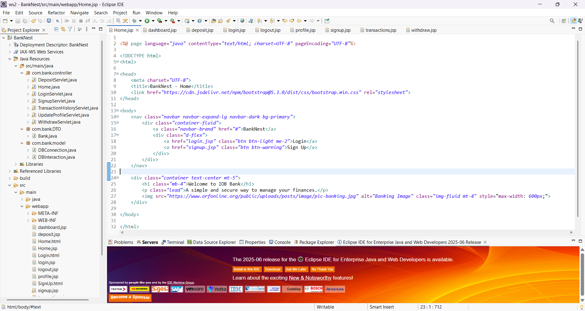
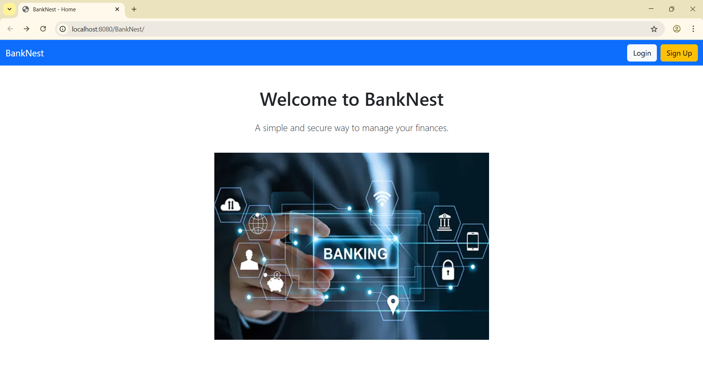
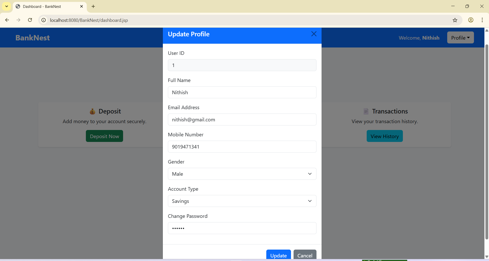
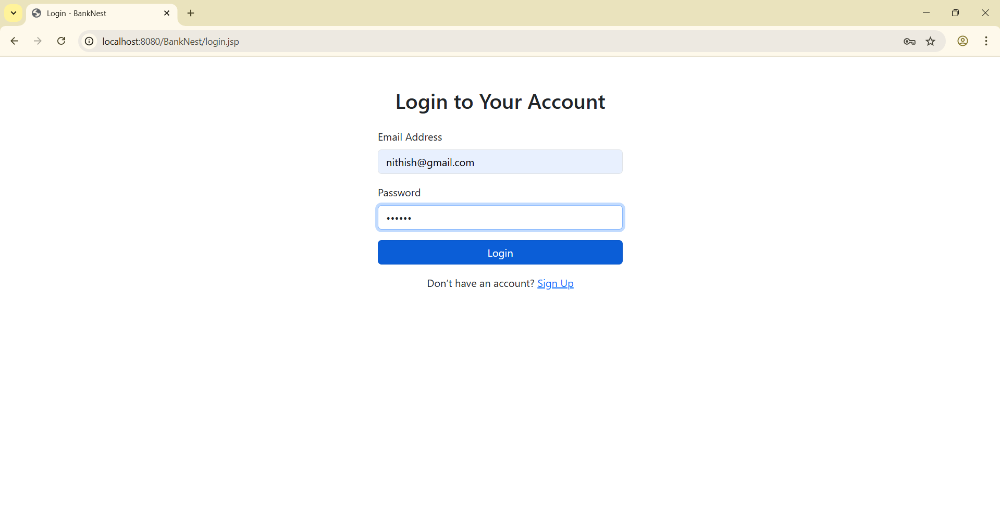
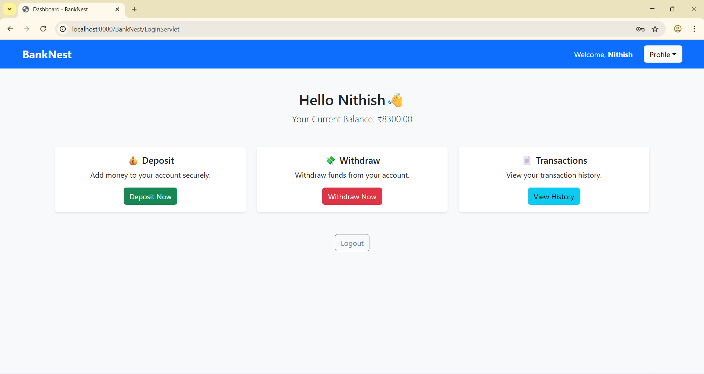

# 🚀 BankNest – Mini Banking Web App 💻🏦

BankNest is a basic banking web application built using Java (JSP, Servlets, JDBC, MVC). It was developed as part of my Java Full Stack training at Pentagon Space to practice real-world full-stack concepts.

---

## ✨ Features

- **User Authentication** – Sign Up / Login
- **Transactions** – Deposit & Withdraw money
- **View Balance** – Check account balance
- **Profile Management** – Update user details
- **Transaction History** – Track deposits & withdrawals

---

## 🛠 Tech Stack

- **Frontend:** JSP, HTML, CSS
- **Backend:** Java Servlets (Java EE)
- **Database:** MySQL
- **Architecture:** MVC

---

## 🚀 Getting Started

### Prerequisites

- Java JDK 8 or higher
- Apache Tomcat 9 or higher
- MySQL Database
- Maven

### Setup Instructions

1. **Clone the repository**
   git clone https://github.com/NITHISH-KUMAR-M-S/BankNest.git

2. **Create the database**

   ```sql
   CREATE DATABASE banknest_db;
   ```

3. **Update database credentials** in your DAO classes (if needed):

   ```java
   String url = "jdbc:mysql://localhost:3306/banknest_db";
   String username = "root";
   String password = "your_password";
   ```

4. **Build the project using Maven**

   ```bash
   mvn clean install
   ```

5. **Deploy the WAR file** to Apache Tomcat (`target/BankNest.war`).

6. **Access the application**

   ```
   http://localhost:8080/BankNest/
   ```

---

## 📂 Folder Structure

```
BankNest/
├── src/main/java        # Java Servlets and Classes
├── src/main/webapp     # JSP pages, CSS, JS
├── pom.xml             # Maven configuration
└── README.md           # Project documentation
```

## 📸 Screenshots

<div style="display: flex; flex-wrap: wrap; gap: 15px;">

  <div style="flex: 1 1 calc(33% - 10px);">
    
    <p align="center"><b>Code Page</b></p>
  </div>

  <div style="flex: 1 1 calc(33% - 10px);">
    
    <p align="center"><b>Home Page</b></p>
  </div>

  <div style="flex: 1 1 calc(33% - 10px);">
    
    <p align="center"><b>Register Page</b></p>
  </div>

  <div style="flex: 1 1 calc(33% - 10px);">
    
    <p align="center"><b>Login Page</b></p>
  </div>

  <div style="flex: 1 1 calc(33% - 10px);">
    
    <p align="center"><b>Dashboard</b></p>
  </div>

</div>


---

## 📝 License

This project is open-source and free to use for learning purposes.

```

---

If you'd like, I can generate this as an actual `README.md` file for you to download and add to your project. Would you like me to do that?
::contentReference[oaicite:0]{index=0}
 
```
